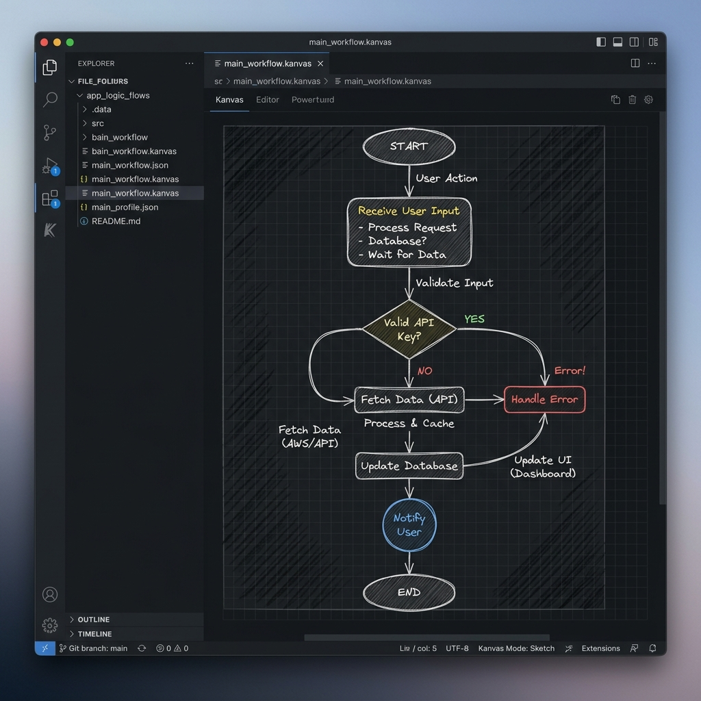

# Kanvas


A hand-drawn style diagramming/whiteboard canvas that opens as a custom editor for `.kanvas` files, right inside VS Code.

## Preview



## Features

- **Custom Editor**: Registered for `*.kanvas` files (JSON structure under the hood).
- **Rich Tools**: Selection (V), Rectangle (R), Ellipse (O), Diamond (D), Arrow (A), Line (L), Freehand Draw (P), Text (T), and Eraser (E).
- **Whiteboard Aesthetics**: Drawing grid background, custom colors (stroke & fill tints), circular selection handles.
- **Styling Panel**:
  - Stroke width: Thin, Medium, Thick.
  - Stroke style: Solid, Dashed, Dotted.
  - Fill style: Hachure, Cross-hatch, Solid.
  - Sloppiness (Roughness): Neat, Artist, Cartoon.
  - Font Family: Handwritten, Normal, Code.
- **Layer Operations**: Move elements to front (`Ctrl+]`) or back (`Ctrl+[`).
- **Hand-drawn style**: Powered by the `rough.js` rendering engine.
- **History & Sync**: Full undo/redo wired into VS Code's native undo stack (Ctrl+Z / Ctrl+Y).
- **Camera controls**: Pan (space+drag or middle-click drag) and Zoom (Ctrl + scroll or bottom-right buttons).
- **Exporting**: Export to PNG or SVG via command palette or controls.
- **Autosave & Dirty-tracking**: Integrates with VS Code's tab UI.

## Project Layout

```
kanvas/
  src/
    extension.ts            entry point, registers the provider
    kanvasEditorProvider.ts  CustomEditorProvider: webview <-> document wiring
    kanvasDocument.ts        CustomDocument: scene state + undo/redo edit stack
  media/
    main.js                  the canvas app that runs inside the webview
    style.css                 toolbar/canvas styling
    rough.js                  bundled rough.js library (hand-drawn rendering)
  sample.kanvas               example file to open on first run
```

## Running it

1. Open this folder in VS Code and press **F5** (Run Extension). This launches an Extension Development Host window.
2. In that new window, open `sample.kanvas` (or create a new one via the command palette: **Kanvas: New Kanvas File**).

## Exporting

With a `.kanvas` file open and focused, run **Kanvas: Export as PNG** or **Kanvas: Export as SVG** from the command palette (Ctrl/Cmd+Shift+P).

## Packaging

```
npm install -g @vscode/vsce
vsce package
```
This produces a `.vsix` you can install into VS Code.
